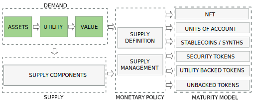

---

import JSONTable from '@site/src/components/ui/JSONTable';
import underlying from "/static/data/underlying.json"
import economic_value from "/static/data/economic_value.json"
import utility from "/static/data/utility.json"
import tokens_utility from "/static/data/tokens_utility.json"

:::danger
`(Under development. Please, come back later. Just published to share the progress)`
:::

## 1. Introduction
---

The nature, behaviour and price of a cryptocurrency is determined by the interaction between a demand and a supply coordinated by a monetary policy. Depending on the policy we will have different types of tokens.

In this post we will examine the demand and leave supply and monetary policy for other posts.

<!-- truncate -->

## 2. Tokenizable Assets
---

In order to allow value capture, we must focus in fungible assets. From the table of assets, only natural resources and commodities have the fungiblity feature. 

<JSONTable theadData={Object.keys(underlying[0])} tbodyData={underlying}/>

## 3. Token Utility
---

### 3.1. Token Ecosystem

### 3.2. Token Utilities

<table class="table w-auto mx-auto fs-6">
	<thead class="thead-dark">
		<tr>
			<th scope="col">Actor</th>
			<th scope="col">Utility</th>
		</tr>
	</thead>
	<tbody>
		<tr>
			<th scope="row">Investors</th>
			<td>Swap CYGAS</td>
		</tr>
		<tr>
			<th scope="row">Exchanges</th>
			<td>Swap CYGAS</td>
		</tr>
		<tr>
			<th scope="row">Filling Plants</th>
			<td>Pay for raw LPG</td>
		</tr>
		<tr>
			<th scope="row">Retailers</th>
			<td>Pay for LPG cylinders</td>
		</tr>
		<tr>
			<th scope="row">Independent Retailers</th>
			<td>Pay for LPG cylinders</td>
		</tr>
		<tr>
			<th scope="row">Consumers</th>
			<td>Pay for LPG orders</td>
		</tr>
		<tr>
			<th scope="row">Institutional Consumers</th>
			<td>Pay for LPG orders</td>
		</tr>
	</tbody>
</table>

## 4. Token Extended Utility
---

### 4.1. Token Extended Ecosystem

	</img>

### 4.2. Typical Token Utilities

<JSONTable theadData={[ 'type', 'name' ]} tbodyData={utility}/>

## 5. Token Intrinsic Value
---

### 5.1. Definition of Value

Economic value differs according to the different Schools of Economic Thought. This is relevant because, when we design a token, we can adhere to the Economic School of our choice. Below there is simplified list of economic values:

<JSONTable theadData={Object.keys(economic_value[0])} tbodyData={economic_value}/>

All these theories of economic value can be classified in 2: 
- objective value theories. The objective, or intrinsic, theories of value hold that the value of an object, or a good, or service, is intrinsic, meaning that it can be estimated using objective measures. Most such theories look to the process of producing an item, and the costs involved in that process, as a measure of the item's intrinsic value.

- subjective value theories. The subjective theory of value, instead, states that prices of goods and services in a market are determined by the subjective preferences of consumers.

### 5.2. Tokens by Value Definition

According to the nature of the value and the way that the value is captured, we have different types of cryptocurrencies:

<JSONTable theadData={Object.keys(tokens_utility[0])} tbodyData={tokens_utility}/>

Once the value is captured, we need to provide additional utilities to the token to retain and, maybe, grow, this value to maintain velocity of circulation under controlled margins.

### 5.3. Subjective Token Value

Intrinsic value is the value that the token gains from the credibility and utility of its project.

## 6. Token Speculative Value
---

Speculative value is the value that the token gains from speculations traders make on a token's price.

## 7. Estimating the Demand

The demand for your token will be motivated because your users apreciate one or more of the utilities of the asset, or assets, that are bound to the token. The demand is related to the physical world on how good is your business offer. If your offer is good, your users will be eager to acquire, or enjoy, the utilities that you are offering and the demand of your token will increase. 

In the next sections we will expose how to undertand the demand of your token, what can the bound assets and utilities be and how can it be quantified.

uantying the demand will help later on to estimate the supply
