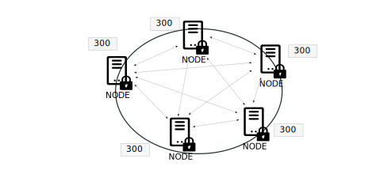
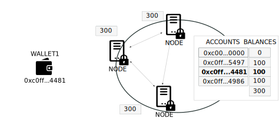
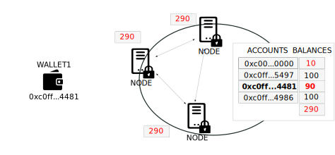
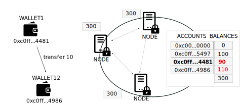
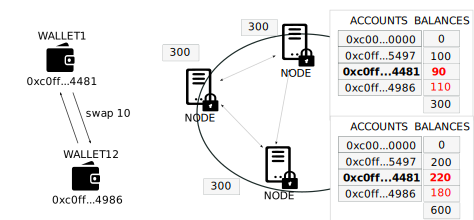
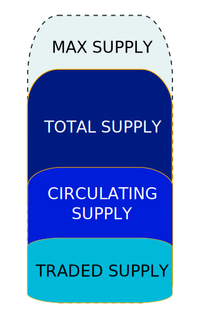

---

:::danger
`(Under development. Please, come back later. Just published to share the progress)`
:::

## 1. Introduction
---

The nature, behaviour and price of a cryptocurrency is determined by the interaction between a demand and a supply coordinated by a monetary policy. Depending on the policy we will have different types of tokens.

We will discuss the Supply and Supply Management in this post and leave demand and Monetary Policy for next posts.

<!-- truncate -->

## 2. Definitions of Supply
---

### 2.1 Total Supply

Supposing that we have a blockchain with a deployed token for a cryptocurrency. This token is implemented as an smart contract and must follow the ERC-20 standard or a derivate of it. Thanks to the blockchain synchronization functionality, the smart contract will be replicated, and always kept in sync, in every single node of the blockchain, including its funcions, variables and memory allocations.

For this standard configuration, Total Supply for a cryptocurrency is defined as the total number of units of this currency that currently exists and are either in circulation or locked. It is the sum of units that were already mined (or issued, or minted) minus the total of coins that were burned (or destroyed). This value is stored as a variable within the smart contract and, therefore, synchronized in all the cloned instances residing inside all the blockchain nodes.

An ERC-20 token deployed in a blockchain includes always a function totalSupply(), as part of the ERC-20 standard, that you can query to find out the total supply of the token at any time.

When designing the supply of the cryptocurrency, the order of magnitude of balances, or of total supply, is not significative. Only the relative balances have an impact on the distribution of wealth.

### 2.2 Balances

The total of units of the cryptocurrency, or total supply, must be owned by holders. Each holder can own a different amount of units of the cryptocurrency, or balance, so we must be able to know how many units is owned by each holder. For this purpose, every instance of our smart contract contains a map structure detailing the holdings of every user. The same that the total supply, this map is seamless kept in sync between all the nodes of the blockchain by the blockchain infrastructure.

A wallet which holds units of the cryptocurrency, identified by his public key, will have an entry in this map structure indicating how many units are holded by the wallet's account. The number of units of the cryptocurrency will be updated whenever the wallet's owners performs operations on the cryptocurrency.

### 2.3 Market Capitalization

The market capitalization (market cap) of a cryptocurrency is calculated by multiplying the number of unit in circulation, that is, the total supply, by the price of an individual unit, token or coin. When designing the supply of the cryptocurrency, the order of magnitude of balances or total supply, is not significative for the capitalization of the cryptocurrency.

## 3. Supply Operations
---

### 3.1 Mint

Mint is the operation to create new Units of a cryptocurrency. By minting one amount of tokens, the total supply of the cryptocurrency will increase by this amount of tokens. The mint operation must be perfomed over an account, so the balance of this account on the balance map of the smart contract will increase by the minted amount.

Increasing the number of existing units of the cryptocurrency decreases the price of each unit, i.e. the price of the token. In order to keep holders value, and cryptocurrency reputation, the mint operation must be restricted to the extrictly necessary to perform the token activities according to the defined token model. 

The mint operation is typically restricted to the cryptocurrency issuer, or some granted role. Minting is typically done on a Token Generation Event (TGE) in token launch or, at any time, on behalf of specific accounts, to grant some kind of activity performed by the account holder.

On a granular level, smart contracts have a function mint() to mint new units of the cryptocurrency with access restricted only to the issuer or minter roles.

### 3.2 Burn

Burn is the opposite operation to Mint. Burn is the operation to detroy unit of the cryptocurrency. By burning one amount of tokens, the total supply of the cryptocurrency will decrease by this amount of tokens. The burn operation must be perfomed over an account, so the balance of this account on the balance map of the smart contract will also decrease by the minted amount.

Decreasing the number of existing units of the cryptocurrency increases the price of each unit, i.e. the price of the token. Therefore, existing holders will be alway interested in burning operations being performed on the cryptocurrency.

The burn operation is typically restricted to the cryptocurrency issuer, or some granted role.

On a granular level, smart contracts have a function burn() to burn new units of the cryptocurrency with access restricted only to the issuer or burner roles.

### 3.3 Transfer

Transfer is an operation performed over 2 account holders, the sender and the receiver. By transferring one amount of tokens, the balance of the sender with decrease and the balance of the receiver will increase by the same amount. Transfer operation do not modiy the total supply.

Transfer does not affect the price of the cryptocurrency.

On a granular level, smart contracts have a function transfer() to transfer units of the cryptocurrency between the sender and the receiver account holder.

### 3.4 Swap

Swap operation involves 2 account holders and 2 cryptocurrencies. By swapping one amount of tokens, both account holders will exchange unit of the 2 cryptocurrencies proportionally to the relative price.

The swap does not affect the price nor the total supply of any of the 2 cryptocurrencies involved.

The swap operation is perfomed by special smart contracts called exchanges and, at the core, is a double atomic transfer operation.

## 4. Changes in the Supply
---

The supply is the number of existing units for the token. The supply is the variable that we can use to provide the expected price profile to the token according to the demand of the token.

The number of units of a token can be fixed or can be variable, depending on the policies defined by the token designers. Tokens with a <b>Fixed Supply</b> follow a gold standard pattern. Tokens with a Variable Supply can be managed by some Supply Management Mechanism to capture some asset feature or can freely float at the mercy of demand. If the supply grows we say the token has an <b>Inflationary Supply</b>. If the supply shrinks we say the token has a <b>Deflationary Supply</b>.

We call <b>Max Supply</b> to the max amount of units that a token can have. Not all tokens have a defined max supply, some tokens can increase the supply indefinitely. We say they are uncapped tokens. Other tokens ha a known Max Supply, either because there is a physical limitation on creation or because it is limited by token designer. These tokens are denominated capped tokens.

	</img>

The number of unit that a token has in a certain moment is called Total Supply. The unit o the token are typically aigned to dierent account and can have in dierent ituation o liuidity. locked v circulating

th circulating upply can b in holdr account or can b in xchang pair rady to b tradd.

### 4.1. Fixed Supply

### 4.2. Inflationary Supply

### 4.3. Supply Emission Policies

### 4.4. Deflationary Supply

## 5. Supply Distribution
---

### 5.1. Investor Holdings

### 5.2. Velocity of Circulation

### 5.3. Distribution of Wealth

- Gini

- Herfindahl-Hirschman Index (HHI)

### 5.4. Whales

## 6. Supply Components
---

### 6.1 Total Supply

### 6.2 Max Supply

### 6.3. Locked Supply

### 6.4. Circulating Supply

### 6.5. Tradeable Supply

## 7. Token Initial Allocations
---

### 7.1 Funding Allocation

### 7.2 Trading Allocation

### 7.3 Operations Allocation

### 7.3 Project Allocation

