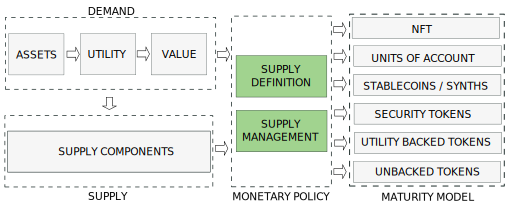
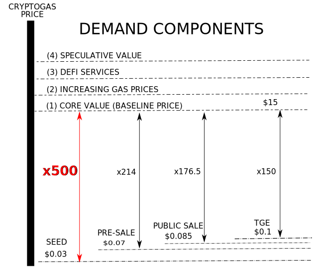
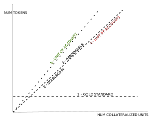

---

import JSONTable from '@site/src/components/ui/JSONTable';
import tokens_utility from "/static/data/tokens_utility.json"

:::danger
`(Under development. Please, come back later. Just published to share the progress)`
:::

## 1. Introduction
---

The nature, behaviour and price of a cryptocurrency is determined by the interaction between a demand and a supply coordinated by a monetary policy. Depending on the policy we will have different types of tokens.

We will discuss the Monetary Policies in this post and leave demand and supply for next posts.

<!-- truncate -->

## 2. Token Price
---

### 2.1 Price Determination

As with any other asset, the price for a token is determined as an equilibrium between demand and supply. Price of Token A expressed in token B is the number of units of token B that investors are willing to pay to acquire a unit of token A.

This evaluation between supply and demand is carried out in the exchanges. Additionally price for a token pair uses to be uniform across the exchanges because arbitrage.

The lower the total traded supply amount across the liquidity pools for a token, the higher the price will get in the exchanges.

<b>Price formation in crypto happens in the exchanges</b>. The price is alway formed between 2 tokens paired in a pool. The exchanges have algorithms to work out the price of every token in the pool depending on their respective demand.

	</img>

The pools where our token is trading, can be in one exchange, or can be in many exchanges, in the same network or distributed across different blockchains. When several exchanges are involved, the price is consolidated between the different pools by investors practicing <b>arbitrage</b>. This guarantees that the price is mostly uniform across all the exchanges on a determined time.

Another point to consider is that <b>only the amount of tokens deposited in exchanges account determine the price at every moment</b>, no matter how many tokens of the supply are held on investors wallets or locked. This means that, in the case that we want to have control over the price, we must be aware of the amount of tokens placed in the pool of the exchanges.

### 2.2 Price Components

As in CRYPTOGAS the supply is fixed in the Value Capture Stage, the price will be only determined by demand, as described in CRYPTOGAS Engineering. In order to increase CRYPTOGAS price we must increase the demand of the token. This will move to investor to hold CRYPTOGAS in their portfolios, the traded supply will be reduced and the price will move higher.

The price will have several components.

* 1 - By guaranteeing that the intrinsic value of the underlying asset is captured we can assume that at the medium term, the value of the token will be 15$. Besides the described base scenario, there are additional deflationary reasons that suggest price of underlying asset will get higher from this baseline:.

* 2 - Gas prices are growing because oil scarcity

* 3 - A token shared by millions can easily find additional utilities in the shape of DeFi Services

* 4 - Finally we must maximize speculative value by providing quality of products and services.

## 3. Supply Policies
---

### 3.1 Supply Definition

Tokenization Models. During the last decade a new tokenization models has been proposed. Tokenization model define how the token is bound to the underlying asset and what it grants or its holders

- no underlaying asset

- utility tokens, which capture an undetermined set of utilities

- security tokens, which provide some kind o yield over a financial token

- stablecoins

- NFT which provide ownerhip of the underlying asset. 

On determining the token supply we can decide between 6 scenarios:

On the basic Gold Standard scenario (1), the supply is fixed. No value of price is captured and the token is hyperdeflationary. this is the paradise or investors because they will see the token price growing.

If we match the Total Supply to the Number Collateral Units, the total value of the token will be captured, no matter if this value is created by primary utility (3), which makes the token redeemable, or by aggregated utility, which will create a Unit of Account (4). In the case that we want to capture the fiat price of the collateral, we must manipulate the balance of the pair in the liquidity pools, which is the case of stablecoins (2).

Finally, to capture the natural value of the collateral, as a natural Unit of Account (5), we need to match the traded supply to the number of collateral units. The problem for this case is that the token wont be reedemable.

<table class="table w-auto mx-auto fs-6">
	<thead class="thead-dark">
		<tr>
			<th scope="col">#</th>
			<th scope="col">Scenario</th>
			<th scope="col">Supply</th>
			<th scope="col">Pairs</th>
			<th scope="col">Capture</th>
			<th scope="col">Deflationary</th>
			<th scope="col">Redeemable</th>
			<th scope="col">Fiat</th>
		</tr>
	</thead>
	<tbody>
		<tr>
			<th scope="row">1</th>
			<th scope="row">Gold Standard</th>
			<td>Fixed</td>
			<td>Any</td>
			<td>No</td>
			<td>Hyper</td>
			<td>No</td>
			<td>Indep</td>
		</tr>
		<tr>
			<th scope="row">2</th>
			<th scope="row">Stablecoin</th>
			<td rowspan="3">Total Supply = Num Collateral Units</td>
			<td>Any</td>
			<td>Price</td>
			<td>No</td>
			<td>Yes</td>
			<td>Dep</td>
		</tr>
		<tr>
			<th scope="row">3</th>
			<th scope="row">Reedemable</th>
			<td>Any</td>
			<td>Value</td>
			<td>Yes</td>
			<td>Yes</td>
			<td>Indep</td>
		</tr>
		<tr>
			<th scope="row">4</th>
			<th scope="row">Unit of Account 1</th>
			<td>Any</td>
			<td>Agg Value</td>
			<td>Yes</td>
			<td>No</td>
			<td>Indep</td>
		</tr>
		<tr>
			<th scope="row">5</th>
			<th scope="row">Unit of Account 2</th>
			<td>Traded Supply = Num Collateral Units</td>
			<td>Any</td>
			<td>Value</td>
			<td>No</td>
			<td>No</td>
			<td>Indep</td>
		</tr>
	</tbody>
</table>

Depending on the goal of every project, a supply definition strategy must be decided. A combination of strategies is also a valid option.

### 3.2. Supply Management Mechanisms

Th intrcation btw th dmand and th upply will din th pric o th tokn and also its proil.

	</img>

There are essentially 3 mechanims to manage the supply:

* expand and collapse the supply by minting and burning token units

* adding tax to transaction

* use a supporting account as reserve

All these Supply Management Mechanisms can be manually executed or automatd a part of some transactional logic in the smart contract. 

##### 3.4.1.1. Burn and Mint

The implicit way to manage the supply is by calling explicit functions in the smart contract to create (mint) and destroy (burn) token units.

In order to create new unit, a <b>mint</b> operation must be executed over the token. This mint operation can be triggered externally by some holder account, internally by the issuing team or be triggered from the token smart contract itself as a response to some defined threshold. A mint operation typically devaluate the price of the token so minting is a discouraged operation as it can hurt the reputation of a token issuer. It should be done only under known circuntances in a predictable way. 

Conversely, we can reduce the supply of token by triggering a <b>burn</b> operation which will have the opposite effect of increasing the price because the supply is reduced for the same demand.

Burn and mint i a coar grain upply managmnt bcau w do not dirctly control th numbr o tokn in th xchang to orm th pric.

##### 3.4.1.2. Stability Fees

Stability Fees are taxes taken by the token on transaction. They are typically automated within the transaction logic and, therefore, not manual intervention is required. This contributes to token tranparency. tability  can alo b ud in conjuction with th rrv approach.

##### 3.4.1.3. Reserve

A in grain managmnt o th tokn pric i by maintaining a rrv account paird to th xchang account. Tokn unit can b addd to th upply whn w want to rduc th upply and incra th pric. And, covrly, tokn unit can b xtractd rom th rrv account to rplnih th xchang account whn w want to xnd th pric.

#### 3.2.4. Elastic Supply Tokens (Rebases)

