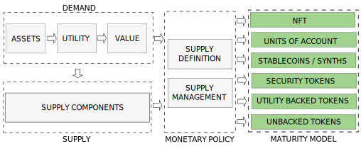

---

import JSONTable from '@site/src/components/ui/JSONTable';
import tokens_utility from "/static/data/tokens_utility.json"

:::danger
`(Under development. Please, come back later. Just published to share the progress)`
:::

## 1. Introduction
---

The nature, behaviour and price of a cryptocurrency is determined by the interaction between a demand and a supply coordinated by a monetary policy. Depending on the policy we will have different types of tokens.

We will discuss the Maturity Model in this post and leave demand and supply for next posts.

<!-- truncate -->

## 2. A Tokenization Maturity Model
---

A Tokenization Maturity Model could be established as a ranking of the purity in capturing the properties of the underlying asset. This model would not evaluate the value of the asset, or its utilities within the token model, but the ability of the capture process. The main criteria for this maturity model would be:

- Decentralization in the network consensus. Existing great work by a16z for protocols decentralization should be referenced here
- Decentralization in the smart contract
- Independence from other currencies

In that way, 2 tokenization protocols capturing gold as underlying asset, could be at different level of maturity depending on the goods of the designed protocol.

The picture below represents a initial structure of the maturity model. It only considers the goal of the capture process. Sub-levels could be established to accommodate different degrees of issuer intervention.

Commodity Money would be at the highest level of the maturity Model as its value matches the value of the underlying asset. However, attention should be paid on the decentralization guaranteed by the processes of the issuer.

## 3. Applications

Each tokenization pattern has a different set of applications.

<table class="table w-auto mx-auto fs-6">
	<thead class="thead-dark">
		<tr>
			<th scope="col">Type</th>
			<th scope="col">Capture</th>
			<th scope="col">Typical Applications</th>
		</tr>
	</thead>
	<tbody>
		<tr>
			<td>Unbacked Tokens</td>
			<td>No</td>
			<td>Governance, Memecoins</td>
		</tr>
		<tr>
			<td>Utility Tokens</td>
			<td>Utility</td>
			<td>Web3 including Infra Tokens, Supply Chain Tokens, eBusiness Tokens (Ticketing, Loyalty, Marketplaces), SocialFi, GameFi, Metaverse</td>
		</tr>
		<tr>
			<td>Security Tokens</td>
			<td>Yield</td>
			<td>DeFi</td>
		</tr>
		<tr>
			<td>Stablecoins</td>
			<td>Price</td>
			<td>DeFi</td>
		</tr>
		<tr>
			<td>Units of Account</td>
			<td>Value</td>
			<td>Commodity backed Cryptocurrencies</td>
		</tr>
		<tr>
			<td>NFTs</td>
			<td>Asset</td>
			<td>Ownership, collectibles</td>
		</tr>
	</tbody>
</table>

### 3.1. Token Patterns as Currencies

If we evaluate the tokenization patterns as potential currencies, we see that only Units of Account match the requirements.

<table class="table w-auto mx-auto fs-6">
	<thead class="thead-dark">
		<tr>
			<th scope="col">Type</th>
			<th scope="col">Collateralized</th>
			<th scope="col">Fungible</th>
			<th scope="col">Stable</th>
			<th scope="col">Decentralized</th>
			<th scope="col">As Currency</th>
		</tr>
	</thead>
	<tbody>
		<tr>
			<td>Unbacked Tokens</td>
			<td>No</td>
			<td>Yes</td>
			<td>No</td>
			<td>Possible</td>
			<td>No Suitable</td>
		</tr>
		<tr>
			<td>Utility Tokens</td>
			<td>Yes</td>
			<td>Yes</td>
			<td>No</td>
			<td>Possible</td>
			<td>No Suitable</td>
		</tr>
		<tr>
			<td>Security Tokens</td>
			<td>Debatable</td>
			<td>Yes</td>
			<td>Yes</td>
			<td>No</td>
			<td>No Suitable</td>
		</tr>
		<tr>
			<td>Stablecoins</td>
			<td>Debatable</td>
			<td>Yes</td>
			<td>Yes</td>
			<td>No</td>
			<td>No Suitable</td>
		</tr>
		<tr>
			<td>Units of Account</td>
			<td>Yes</td>
			<td>Yes</td>
			<td>Yes</td>
			<td>Possible</td>
			<td>Suitable</td>
		</tr>
		<tr>
			<td>NFTs</td>
			<td>Yes</td>
			<td>No</td>
			<td>Yes</td>
			<td>Yes</td>
			<td>No Suitable</td>
		</tr>
	</tbody>
</table>

Unbacked Tokens cannot be a currency because they do not have any collateral and are not stable. 

NFTs cannot be a currency because they are not fungible.

Stablecoins/Synth and Security token cannot be a currency because they are fiat and, therefore, centralized.

Utility Token have been created as ecosystem barebones but they are not stable to become currencies.

Only Units of Account can potentially implement Sound Money. However a design is required for this mission.

## 4. Tokenization Map

<table class="table w-auto mx-auto fs-6">
	<thead class="thead-dark">
		<tr>
			<th scope="col"></th>
			<th scope="col"></th>
			<th scope="col" colspan="6">Maturity Model</th>
		</tr>
		<tr>
			<th scope="col">Type</th>
			<th scope="col">Assets</th>
			<th scope="col">Unbacked</th>
			<th scope="col">Utility</th>
			<th scope="col">Yield</th>
			<th scope="col">Price</th>
			<th scope="col">Value</th>
			<th scope="col">Asset</th>
		</tr>
	</thead>
	<tbody>
		<tr>
			<td rowspan="6">Physical Assets	</td>
			<td>Commodity</td>
			<td></td>
			<td></td>
			<td></td>
			<td></td>
			<td>X</td>
			<td></td>
		</tr>
		<tr>
			<td>Real Estate</td>
			<td></td>
			<td></td>
			<td></td>
			<td></td>
			<td></td>
			<td></td>
		</tr>
		<tr>
			<td>Art</td>
			<td></td>
			<td></td>
			<td></td>
			<td></td>
			<td></td>
			<td></td>
		</tr>
		<tr>
			<td>Art</td>
			<td></td>
			<td></td>
			<td></td>
			<td></td>
			<td></td>
			<td></td>
		</tr>
		<tr>
			<td>Industrial Assets</td>
			<td></td>
			<td></td>
			<td></td>
			<td></td>
			<td></td>
			<td></td>
		</tr>
		<tr>
			<td>Collectibles</td>
			<td></td>
			<td></td>
			<td></td>
			<td></td>
			<td></td>
			<td></td>
		</tr>
		<tr>
			<td rowspan="5">Digital Assets</td>
			<td>Digital Art</td>
			<td></td>
			<td></td>
			<td></td>
			<td></td>
			<td></td>
			<td></td>
		</tr>
		<tr>
			<td>Digital Collectibles</td>
			<td></td>
			<td></td>
			<td></td>
			<td></td>
			<td></td>
			<td></td>
		</tr>
		<tr>
			<td>Music</td>
			<td></td>
			<td></td>
			<td></td>
			<td></td>
			<td></td>
			<td></td>
		</tr>
		<tr>
			<td>Gaming</td>
			<td></td>
			<td></td>
			<td></td>
			<td></td>
			<td></td>
			<td></td>
		</tr>
		<tr>
			<td>Corporate Branding</td>
			<td></td>
			<td></td>
			<td></td>
			<td></td>
			<td></td>
			<td></td>
		</tr>
		<tr>
			<td rowspan="5">Financial Assets</td>
			<td>Currencies</td>
			<td></td>
			<td></td>
			<td></td>
			<td></td>
			<td></td>
			<td></td>
		</tr>
		<tr>
			<td>Bonds</td>
			<td></td>
			<td></td>
			<td></td>
			<td></td>
			<td></td>
			<td></td>
		</tr>
		<tr>
			<td>Equities</td>
			<td></td>
			<td></td>
			<td></td>
			<td></td>
			<td></td>
			<td></td>
		</tr>
		<tr>
			<td>Investment Funds</td>
			<td></td>
			<td></td>
			<td></td>
			<td></td>
			<td></td>
			<td></td>
		</tr>
		<tr>
			<td>Loans</td>
			<td></td>
			<td></td>
			<td></td>
			<td></td>
			<td></td>
			<td></td>
		</tr>
		<tr>
			<td rowspan="8">Certifications</td>
			<td>Entry Tickets</td>
			<td></td>
			<td></td>
			<td></td>
			<td></td>
			<td></td>
			<td></td>
		</tr>
		<tr>
			<td>Proof of Participation</td>
			<td></td>
			<td></td>
			<td></td>
			<td></td>
			<td></td>
			<td></td>
		</tr>
		<tr>
			<td>Diplomas and Certificates</td>
			<td></td>
			<td></td>
			<td></td>
			<td></td>
			<td></td>
			<td></td>
		</tr>
		<tr>
			<td>Web Domains</td>
			<td></td>
			<td></td>
			<td></td>
			<td></td>
			<td></td>
			<td></td>
		</tr>
		<tr>
			<td>Proof of Maintenance</td>
			<td></td>
			<td></td>
			<td></td>
			<td></td>
			<td></td>
			<td></td>
		</tr>
		<tr>
			<td>Vouchers</td>
			<td></td>
			<td></td>
			<td></td>
			<td></td>
			<td></td>
			<td></td>
		</tr>
		<tr>
			<td>Loyalty Points</td>
			<td></td>
			<td></td>
			<td></td>
			<td></td>
			<td></td>
			<td></td>
		</tr>
		<tr>
			<td>Awards</td>
			<td></td>
			<td></td>
			<td></td>
			<td></td>
			<td></td>
			<td></td>
		</tr>
	</tbody>
</table>

