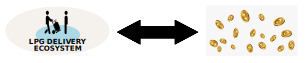

---

:::danger
`(Under development. Please, come back later. Just published to share the progress)`
:::

## 1. Introduction
---

Existing cryptocurrencies come mainly in 3 flavours:

- the weakest tokens are unbacked,

- utility tokens are they backed by some undetermined amount of value,

- and finally we have tokens which are artificially forced to capture a price (stablecoins, synths, security tokens).

Here we are introducing a new kind of cryptocurrency: **an Unit of Account**. An Unit of Account is the only cryptocurrency that can implement sound money.

<!-- truncate -->

## 2. Requirements
---

Value Capture Tokens capture the underlying value by matching their supply with number of units captured and leaving the price floating free. Tokens capturing value are considered Unit of Account or Commodity backed Money.

A cryptocurrency capturing value, also known as an Unit of Account, is an specialized Utility Token that binds his supply to the marginal utility of the underlying asset or service. Unlike stablecoins, where the price is forcedly tied to the external price of the underlying asset, an Unit of Account allows the price floating and to be freely determined by the underlying market. The value is captured wheh the supply of the currency is adjusted to match the demand of the asset.

Capturing value is a long term task and has specific requirements in order to truly represent the value of the asset. 

### 2.1. Underlying Market

Have an underlying market for price formation. The first requirement needed by a currency capturing value of commodities is an underlying market with price formation for this commodity. To our knowledge, only Cryptogas can currently deliver this.

### 2.2. Integrate Decentralization

## 3. Step 1 - Design the Unit of Account
---

### 3.1. Understand Target Ecosystem

Crypto tokenization is the process of converting something of value into a digital token that's usable on a blockchain application. In the context of LPG delivery, we will convert LPG orders into tokens.

### 3.2. Identify Token Utilities

### 3.3. Split Token Utilities

Additional utilities can be delivered with an stablecoin.

### 3.4. Define the Utilities / Unit of Account Bind

As a LPG order is a fungible good, in order to capture a persistent value, we will tokenize repeatable orders. Typically, we can assume that a gas cylinder provides value for 1 month to an average family, so we can make the assumption that our token will capture a monthly value of a LPG cylinder. This will also help to stabilize the supply of our currency.

amount of bound assets

### 3.5. Define the Stablecoin Utilities

## 4. Step 2 - Build the Unit of Account
---

### 4.1. Security

Additionally, many other aspects of commodity value capture, as the compliance implications, reporting or security, suitable markets, driven projects, 

### 4.2. Compliance

### 4.3. Reporting

### 4.4. Privacy

### 4.5. Upgradeability

which can be partially upgraded over the time, e.g. new compliance requirements.

## 5. Step 3 - Build the Stablecoin
---

## 6. Step 4 - Run Value Capture
---

### 6.1. Define Value Capture Event

### 6.2. Capture Value

Collateralize Token
* convrly capturing pric nds an captur priod until th arkt is big nough. This disabls a Unit o Account to captur th pric all th tim. A wll managd unit o account must includ a priod o pric captur and manag th supply.

### 6.3. Maintain Value

Match supply and demand
to captur th pric o ths utilitis
must hav a 1-to-1 rlationship btwn th supply o th cryptocurrncy and th units o th undrlaying assts

## 7. Features
---

### 7.1. Decentralization

Fiat independent

### 7.2. Redeemability

* Collateral not needed A collateral do not give a price ormation. It can b ud to rdm and to  ix pric but not to captur a pric. Thror collatrla is ndd or a stablcoin

## 8. Applications
---

Once we know we can capture the intrinsic value of an asset, we can focus on what kind of assets are suitable to back sound mony and what projects can be executed.

<table class="table w-auto mx-auto fs-6">
	<thead class="thead-dark">
		<tr>
			<th scope="col">Asset</th>
			<th scope="col">Asset</th>
			<th scope="col">Examples</th>
		</tr>
	</thead>
	<tbody>
		<tr>
			<td>Natural Resources</td>
			<td></td>
			<td></td>
		</tr>
		<tr>
			<td>Physical Assets</td>
			<td></td>
			<td></td>
		</tr>
	</tbody>
</table>

## 9. Regulation
---

## 10. Market
---

This is a new market to be created. Derived projects are specially suitable for developing countries. Sound money is suitable for all countries. 

