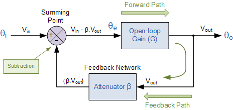
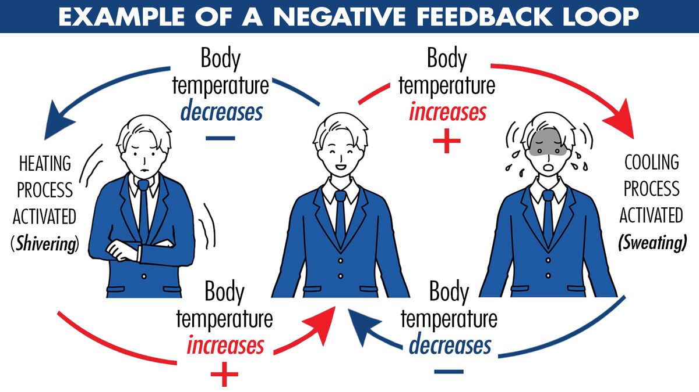
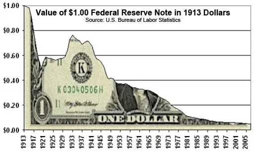
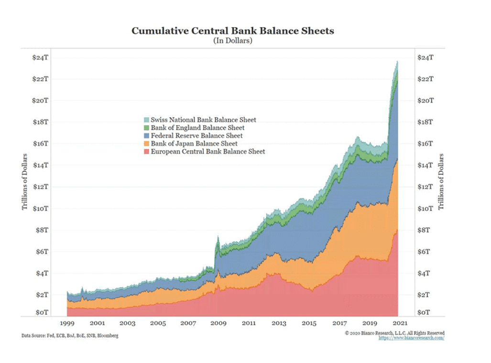
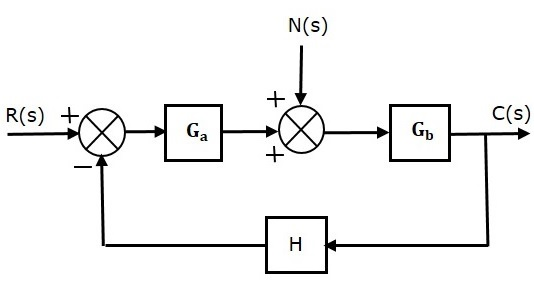
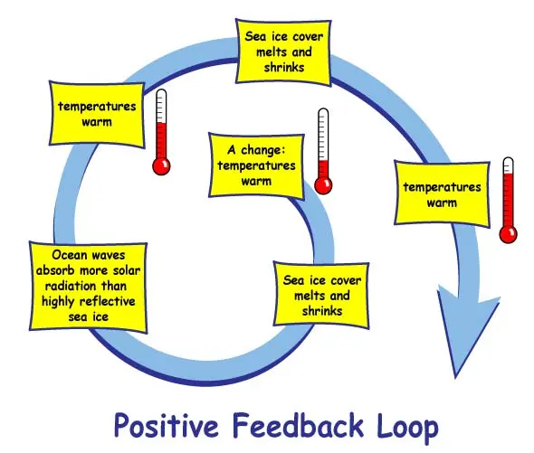
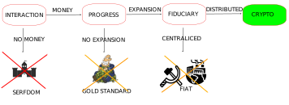

---

:::danger
`(Under development. Please, come back later. Just published to share the progress)`
:::

## 1. Introduction
---

Historically, commodities has been used as basic forms of money. The problem is that they lack portability. This created the representative money or commodities backed money. However, this was replaced by fiat. Despite there is long way to go, crypto delivers the foundation to bring representative money back in a portable way.

<table>
  <tr>
    <td></td>
    <td></td>
    <td></td>
    <td></td>
    <td></td>
    <td></td>
    <td></td>
    <td></td>
  </tr>
  <tr>
    <td></td>
    <td>Barter</td>
    <td>Commodity</td>
    <td>Metal</td>
    <td>Backed</td>
    <td>Fiat</td>
    <td>Plastic</td>
    <td>Crypto</td>
  </tr>
  <tr>
    <td>Uniform</td>
    <td>-</td>
    <td>-</td>
    <td>-</td>
    <td>-</td>
    <td>-</td>
    <td>-</td>
    <td>-</td>
  </tr>
  <tr>
    <td>Divisible</td>
    <td>-</td>
    <td>-</td>
    <td>-</td>
    <td>-</td>
    <td>-</td>
    <td>-</td>
    <td>-</td>
  </tr>
  <tr>
    <td>Scarce</td>
    <td>-</td>
    <td>-</td>
    <td>-</td>
    <td>-</td>
    <td>-</td>
    <td>-</td>
    <td>-</td>
  </tr>
  <tr>
    <td>Durable</td>
    <td>-</td>
    <td>-</td>
    <td>-</td>
    <td>-</td>
    <td>-</td>
    <td>-</td>
    <td>-</td>
  </tr>
  <tr>
    <td>Portable</td>
    <td>-</td>
    <td>-</td>
    <td>-</td>
    <td>-</td>
    <td>-</td>
    <td>-</td>
    <td>-</td>
  </tr>
  <tr>
    <td>Acceptable</td>
    <td>-</td>
    <td>-</td>
    <td>-</td>
    <td>-</td>
    <td>-</td>
    <td>-</td>
    <td>-</td>
  </tr>
  <tr>
    <td>Recognised</td>
    <td>-</td>
    <td>-</td>
    <td>-</td>
    <td>-</td>
    <td>-</td>
    <td>-</td>
    <td>-</td>
  </tr>
  <tr>
    <td>Engine</td>
    <td colspan='4'>Price Formation Machine</td>
    <td colspan='2'>Abandoned Road</td>
    <td>Many</td>
  </tr>
</table>

<!-- truncate -->

## 2. The price formation machine
---

### 2.1. Negative Feedback System

A Negative feedback occurs when some function of the output of a system is fed back in a manner that tends to reduce the fluctuations in the output, whether caused by changes in the input or by other disturbances..

|    |   | 
|-------------------------------------------------------|-----------------------------------------------------------------------|

A Negative feedback tends to reduce the effects of gain change but, in exchange, increases stability. A negative feedback system is a self regulation mechanism that helps maintain stability or balance in a system.

A society with a good as money creates a Negative feedback System. This can be applied to Barter, Commodity Money and Metal Money. A society with a money which value can be traced back ("regressed") to its value as a commodity also creates a Negative feedback System. This can be applied to Representative Money.

### 2.2. How does it work?

Features
- Price formation follows marginal wishes of consumers
- Relative prices prioritize consumers wishes
- Resources are allocated according to consumers wishes.
- Entrepreneurs get fair signals about market demand
- Entrepreneurs assume the risk of their projects
- Companies are funded only by sales, according to consumers aggregated demand.
- Little entry barriers for new providers.
- New demand is always satisfied by providers.
- Values are freely chosen by citizens.

### 2.3. Why this configuration fails?

Problems
- Hoarding
- Externalities
- Critical Resources
- Money Scarcity
- The Problem of Credit

## 3. The abandoned road
---

The road is abandoned when the price formation is broken

Monetary Expansion
Central Planning

Scientifically planned society. Debate on neutrality of money, Normative vs positive economics

|    |   | 
|-------------------------------------------------------|-----------------------------------------------------------------------|

You can explore a more extended list of changes on this web.

### 3.1. Positive Feedback System

A society driven by monetary expansion is an example of Positive Feedback System

In a positive feedback mechanism, the output of the system stimulates the system in such a way as to further increase the output. As a consequence it amplifies or magnifies a certain disturbance or activity, leading to an increase in magnitude. Positive feedback mechanisms control self-perpetuating events that can be out of control. This tends to move a system away from its equilibrium state and make it more unstable.

|    |   | 
|-------------------------------------------------------|-----------------------------------------------------------------------|

### 3.2. Why this configuration fails?

- Price Formation is distorted.
- Distortion in relative prices
- Misallocation of resources.
- Impossibility of Economic Calculation
- Entrepreneurs get distorted signals about market demand.
- Companies are funded by credit.
- High entry barriers for new providers.
- Projects risks is transferred to citizens
- Mismatches between supply and demand. Cantillon effects
- Values imposed by credit preferences.

## 4. Where we are?
---

## 5. Privately Issued Currencies
---

### 5.1. Currency as a driver

A Society with Privately Issued Currencies is a return to the Negative Feedback System but solves the problem of this structure

- Hoarding won't cut liquidity
- Externalities can be fixed
- There are not Critical Resources
- No Money Scarcity
- Availability of Credit

### 5.2. Best of both worlds

Debt without Cantillon

- Daily poll on resource assignment. Investors and consumers, as cryptousers, decide on every action to whom assign productive resources based on their perception on the credibility of the issuer.
- Competence of money. Dislike centralized money issuing, when the money is issued by private parties in competence their relative value is proportional to the credibility of the issuer. This triggers the necessity for the issuer to boost credibility.
- Correct price formation. Investors translate to the coins the relative value that the perceive from the issuer. Consumers translate to the articles the relative value that they perceive in goods and services. Therefore, there is a correct price formation according to will of citizens.
- Relative prices prioritize consumers wishes
- Resources are allocated according to consumers wishes.
- Entrepreneurs get fair signals about market demand
- Private Investor assume the risk of their projects
- Companies are funded only by credit of investors.
- Little entry barriers for new providers.
- New demand is always satisfied by providers.
- Correct match demand/supply. Having the correct price formation for goods and services according to the will of citizens guarantees their supply matches exactly their expected demand without overpricing or undervalued mismatches of centralized money issuing. Let me social machine work on its own without bias.
- Values are freely chosen by citizens.

## 7. Comparison
---

<table>
  <tr>
    <td></td>
    <td>Barter, Commodity, Metal, Representative</td>
    <td>Fiat, Plastic</td>
    <td>Private Currencies</td>
    <td>Crypto</td>
  </tr>
  <tr>
    <td>Price Formation</td>
    <td>-</td>
    <td>-</td>
    <td>-</td>
    <td>-</td>
  </tr>
  <tr>
    <td>Relative Prices</td>
    <td>-</td>
    <td>-</td>
    <td>-</td>
    <td>-</td>
  </tr>
  <tr>
    <td>Liquidity Available</td>
    <td>-</td>
    <td>-</td>
    <td>-</td>
    <td>-</td>
  </tr>
  <tr>
    <td>Critical Resources</td>
    <td>-</td>
    <td>-</td>
    <td>-</td>
    <td>-</td>
  </tr>
  <tr>
    <td>Allocation of Resources</td>
    <td>-</td>
    <td>-</td>
    <td>-</td>
    <td>-</td>
  </tr>
  <tr>
    <td>Economic Calculation</td>
    <td>-</td>
    <td>-</td>
    <td>-</td>
    <td>-</td>
  </tr>
  <tr>
    <td>Credit Availability</td>
    <td>-</td>
    <td>-</td>
    <td>-</td>
    <td>-</td>
  </tr>
  <tr>
    <td>Entry Barriers</td>
    <td>-</td>
    <td>-</td>
    <td>-</td>
    <td>-</td>
  </tr>
  <tr>
    <td>Projects Risk</td>
    <td>-</td>
    <td>-</td>
    <td>-</td>
    <td>-</td>
  </tr>
  <tr>
    <td>Supply / Demand matching	</td>
    <td>-</td>
    <td>-</td>
    <td>-</td>
    <td>-</td>
  </tr>
  <tr>
    <td>Externalities</td>
    <td>-</td>
    <td>-</td>
    <td>-</td>
    <td>-</td>
  </tr>
  <tr>
    <td>Social Values</td>
    <td>-</td>
    <td>-</td>
    <td>-</td>
    <td>-</td>
  </tr>
</table>

## 1. Introduction
---

<!-- truncate -->

## 2. Currency Tokens

### 4.1. Currency Protocols

Once we have dicussed Tokenization Protocols and introduced tokens, is time now for Currencies as a new particular case of Tokens. 

Currencies, by definition, should exhibit a very stable price profile. To achieve this goal, they hould take its price from a large underlaying market with low fluctuation. This confers currencies with a specific set of utilities that more generic tokens are not suitable to fulfill.

### 4.3. Currency Utilities

Tradicionally, it ha bn aumd that th unction o mony ar 3:

* man xchang

* unit o account

* tor o valu

A currncy can provid om or all th 3 unction. Howvr, bn tor o valu and man o xchang at th am ti i diicult bcau th Grhham Law. typically a currncy will pcializd in on o th 3 unction.

	</img>

 

### 4.4. Coexisting Monetary Protocols

### 4.5. Monetary Protocols Industry

aggrgator
reserve?

insurers

analyt

auditor

  

   

## 2. The quality of money

## 5. Currency Tokens as Mean of Payment

### 5.2. Dinition

no special ecosystem

No ruird backing at

 Additional Utilities

xiting
Utility Tokens

Fiat Stablecoins

### 5.1. Mean of Payment Requirements

There are not many requirement to use a currency token as a mean of payment beyond those applied to a physical currency.

- the main requirement probably is that it must be <b>aceptable</b> and <b>recognised</b>. And this raises 2 challenges: the velocity of circulation and the usability of the wallets.

- the token must <b>comply with the regulations</b> in the jurisdictions where is deployed. This does not mean it should be deployed in all jurisdictions, as some jurisdiction apply rules incompatible with decentralization

- the token optionally can provide <b>privacy</b> to its users, considering the regulation

#### 5.1.1. The challenge of Velocity of Circulation

#### 5.1.2. The challenge of Wallets

#### 5.1.3. The challenge of Compliance

#### 5.1.4. The challenge of Privacy

  

   

## 6. Currency Tokens as Store of Value

### 6.2. Dinition

no special ecosystem

No ruird. Dcntralization i nough

Convenient to have backing aet to guarantee the upply

 Additional Utilities

xiting

### 6.1. Store of Value Requirements

- the price of the token must be <b>stable price</b> to enable further utilities. This includes stable supply.

- the token must be <b>secure</b> and not subject to any hack

- the token must be <b>decentralized</b> which means no one, even the issuer, should be able to interfere its behaviour. As, on the other hand, we must stabililize the price, supply management techniques, such as mint/burn, reserve or stability fees, must be transparently performed by the transactional logic without manual intervention

- the token must be <b>transparent</b> and disclose all the required information to issuers, holders and regulators

#### 5.1.3. The challenge of Security

#### 6.1.1. The challenge of Decentralization

#### 6.1.1. The challenge of Transparency

  

   

## 7. Currency Tokens as Unit of Account (UoA)
---

A UoA provid a phyical backing to a currency. Thi i an additional guarant on tability. 

By adjusting the supply to the demand, a UoA captures the economic value of the asset in the market where this UoA is used as mean of payment. The exchanges are in charge of converting this value into a price, first with the tokens directly paired, and after with the rest of tokens.

### 7.2. UoA Requirements

Creating a UoA brings additional reuirement to the previous token type analized. They are as follows:

* a UoA needs fulfill requirements for a store o value

* differently to a stablecoin, a UoA needs an <b>underlying market</b> for price formation

* the underlying asset must be <b>fungible</b>.

### 7.4. Defining the core utility

### 7.5. Including additional utilities

- governance

## 7. References
---

